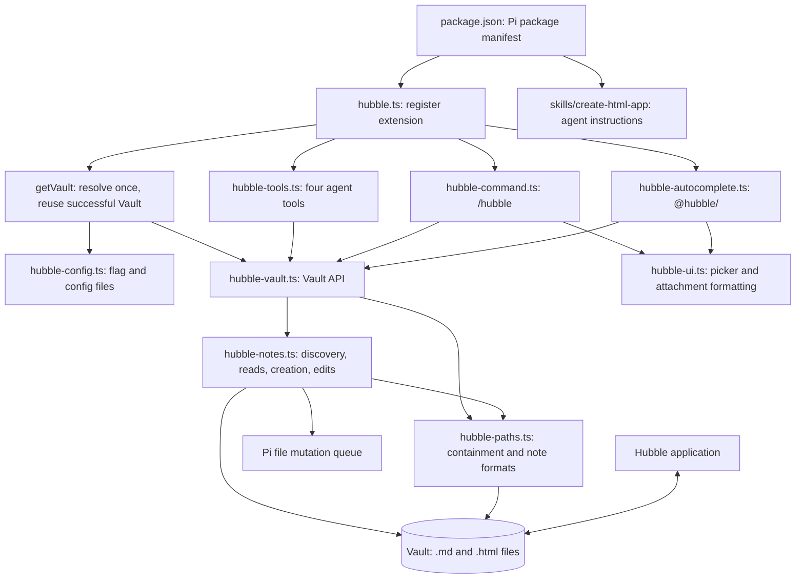
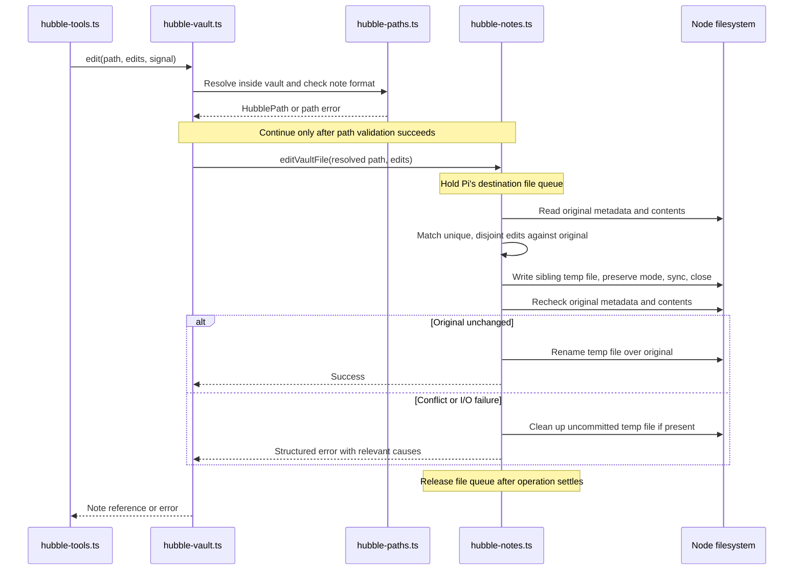
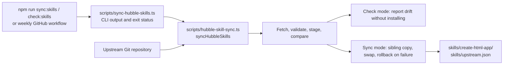

# Architecture

pi-hubble gives Pi access to the Markdown and HTML files in a Hubble vault.
The extension reads and writes those files directly through Node's filesystem
APIs. Hubble and Pi share the same files; the extension does not call a Hubble
server API.

The package also bundles an upstream skill that teaches the agent how to build
HTML Apps for Hubble. That skill supplies instructions; the extension supplies
the tools that operate on notes.

## Runtime map

Arrows show the main wiring and calls, rather than every TypeScript import.
All three entry points receive the same lazy `getVault` function.

`hubble.ts` registers the `--hubble-dir` flag and wires the other modules together.
The first operation resolves configuration and opens a `Vault`; successful
construction is reused, while failed attempts can be retried. The flag takes
precedence over trusted project configuration, which takes precedence over global
configuration. There is no default vault. See [README.md](README.md#vault-configuration)
for paths and installation details.

## Entry points and their routes

The agent tools are defined in [hubble-tools.ts](extensions/hubble-tools.ts).
Pi validates their Typebox schemas; handlers translate arguments into `Vault`
operations and format the results for the agent.

| Entry point      | Route through `Vault`                                     | Result                                                                                                               |
| ---------------- | --------------------------------------------------------- | -------------------------------------------------------------------------------------------------------------------- |
| `hubble_search`  | `searchPage` → discovery and note reads                   | Matching source lines, with a continuation offset when more exist.                                                   |
| `hubble_read`    | `read` → path resolution and file read                    | A selected range of note lines.                                                                                      |
| `hubble_create`  | `create` → filename selection and exclusive file creation | New note path; a document preview is available in Pi's TUI.                                                          |
| `hubble_edit`    | `edit` → path resolution and exact replacements           | Updated note path and edit count.                                                                                    |
| `/hubble find`   | `list` → fuzzy filename filtering                         | Picker selection becomes a Pi `@` attachment.                                                                        |
| `/hubble search` | `search` → all matching notes                             | Content matches determine which notes appear in the picker.                                                          |
| `/hubble new`    | `create` for a supplied title                             | Creates a blank note and attaches it. With a blank title, asks the idle agent to draft a note using `hubble_create`. |
| `@hubble/`       | Cached `list` → fuzzy filtering → path revalidation       | Up to 50 suggestions, inserted as ordinary Pi `@` attachments.                                                       |

Tool searches retain one page and stop reading after one additional match proves
there is another page. They still discover the note paths first. Interactive
content search uses the unbounded `search` method to populate the picker.
Autocomplete caches discovery for up to one second; successful creation changes
`Vault.discoveryVersion` so the next lookup refreshes it.

Search and read responses pass through `truncateOutput` in `hubble-tools.ts`.
Pi's line and byte limits bound the text sent to the model; oversized output is
saved through the injectable `OutputFileSystem` seam to a temporary file outside
the vault. Pagination and output-size truncation are separate concerns.

## Files and responsibilities

| File                                                        | Owns                                                                                                                                   |
| ----------------------------------------------------------- | -------------------------------------------------------------------------------------------------------------------------------------- |
| [hubble.ts](extensions/hubble.ts)                           | Extension registration, lazy configuration, and shared `getVault` wiring.                                                              |
| [hubble-config.ts](extensions/hubble-config.ts)             | Config parsing, project-trust handling, root precedence, and configuration errors.                                                     |
| [hubble-tools.ts](extensions/hubble-tools.ts)               | Tool schemas, edit-argument compatibility, response formatting, output persistence, and create previews.                               |
| [hubble-command.ts](extensions/hubble-command.ts)           | `/hubble` parsing, interactive prompts, note selection, and agent-assisted creation.                                                   |
| [hubble-autocomplete.ts](extensions/hubble-autocomplete.ts) | Mention detection, discovery caching, suggestion filtering, and delegation to Pi's other completions.                                  |
| [hubble-ui.ts](extensions/hubble-ui.ts)                     | The filterable note picker and escaped attachment strings, using Pi's TUI components.                                                  |
| [hubble-vault.ts](extensions/hubble-vault.ts)               | The shared note API and search orchestration. Callers use this instead of coordinating storage themselves.                             |
| [hubble-paths.ts](extensions/hubble-paths.ts)               | Canonical roots, vault-relative path resolution, symlink containment, supported formats, and branded `HubblePath` values.              |
| [hubble-notes.ts](extensions/hubble-notes.ts)               | Pure document/slug/edit helpers alongside filesystem operations, queues, atomic replacement, and the injectable `NoteFileSystem` seam. |
| [hubble-errors.ts](extensions/hubble-errors.ts)             | Tagged storage, path, validation, conflict, and skill-sync errors; filesystem error mapping; `throwHubbleError`.                       |

Expected failures travel as `Result<T, E>` values using `better-result`. Tool
handlers convert them into Pi-compatible exceptions at `throwHubbleError`;
interactive commands notify the user and return. Autocomplete hides expected
failures and offers no suggestions. Cancellation and programmer defects may
propagate as exceptions.

## How an edit reaches disk

Creation holds a vault-root queue while allocating a filename, then also holds
the destination queue through writing and cleanup. Reads and edits use that same
file queue. Exact edits preserve the UTF-8 BOM and the detected line-ending style.
Discovery revalidates roots, directories, and note paths while skipping symlinks.

These are in-process queues shared with Pi, not locks acquired by Hubble.
External-save detection is optimistic: another application can still save between
the final conflict check and rename.

## Bundled skill maintenance

This runs during maintenance, separately from the extension's runtime.

The vendored skill and its reference files remain verbatim upstream content.
`skills/upstream.json` records their provenance. The sync operation returns
`SkillSyncError` values and uses an injectable filesystem; a failed rollback keeps
its backup and reports the recovery path. The weekly workflow opens or updates a
PR with upstream changes.

## Tests and development support

- `test/hubble-tools.test.ts`, `hubble-command.test.ts`, `hubble-autocomplete.test.ts`,
  `hubble-ui.test.ts`, and `hubble-extension.test.ts` cover Pi-facing behavior.
- `test/hubble.test.ts`, `hubble-notes.test.ts`, `hubble-search-page.test.ts`,
  `hubble-concurrency.test.ts`, `hubble-discovery-safety.test.ts`, and
  `hubble-io-failures.test.ts` cover note behavior, security checks, queues, and
  injected failures using real temporary files.
- `test/hubble-package.test.ts` checks packaging; `hubble-skill-sync.test.ts` uses
  a local Git upstream for offline sync tests. `test/test-cast.ts` supports small
  Pi API fixtures at test boundaries.
- [The integration suite](test/integration/pi-hubble.integration.test.ts) loads
  the package through Pi's CLI/RPC and SDK paths without an LLM or API credentials.
- `tsconfig.json` enables strict type checking. `oxlint.config.ts` loads the custom
  rules in `tools/oxlint/anti-slop/`. `.github/workflows/` runs CI and skill sync;
  `AGENTS.md` and `.agents/skills/coding-standards/` describe repository conventions.

For a first code read, follow `hubble.ts` → `hubble-tools.ts` → `hubble-vault.ts`,
then open `hubble-paths.ts` and `hubble-notes.ts` for the storage details.
